```{r setup, include=FALSE}
options(htmltools.dir.version = FALSE)
```

class: center, middle

```{r, out.width = "1000px", echo=FALSE}
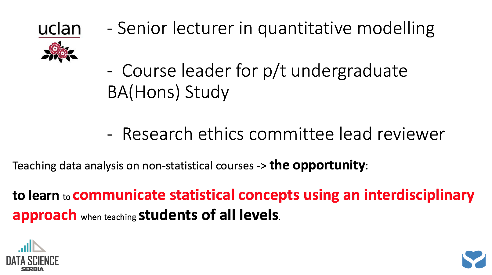
```
---
class: center, middle

```{r, out.width = "900px", echo=FALSE}
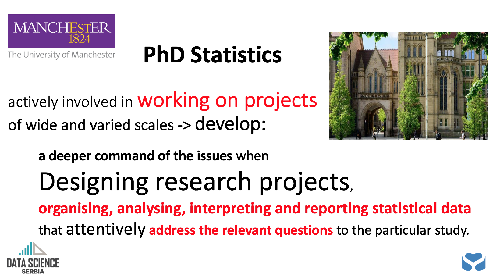
```

---
class: center, middle

```{r, out.width = "900px", echo=FALSE}
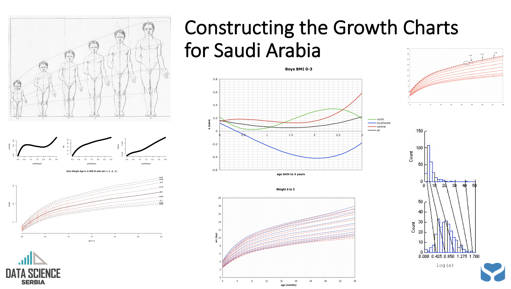
```

---

class: center, middle

```{r, out.width = "900px", echo=FALSE}
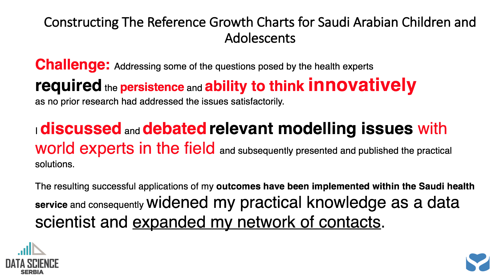
```

---
class: center, middle

```{r, out.width = "900px", echo=FALSE}
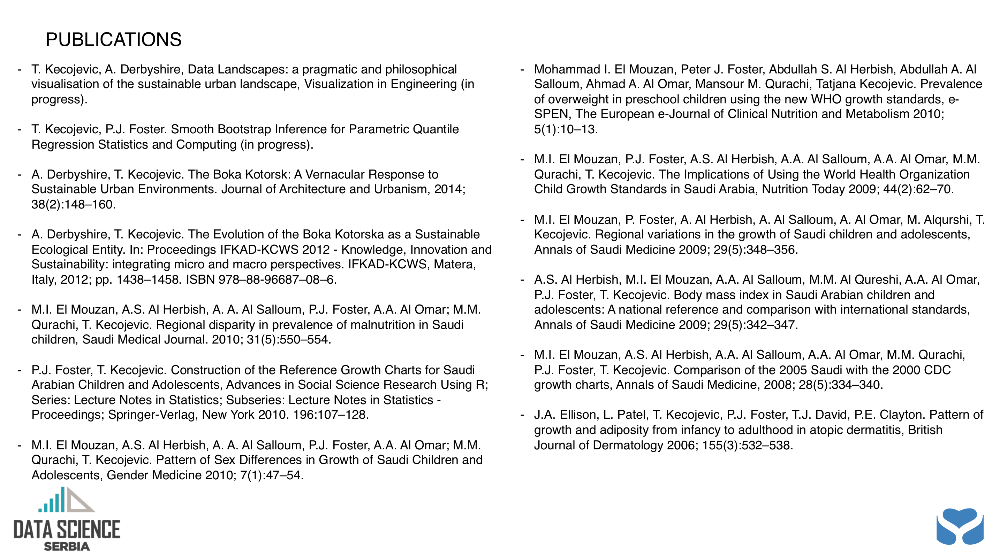
```

---
class: center, middle

```{r, out.width = "900px", echo=FALSE}
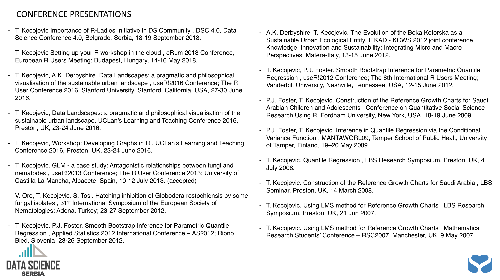
```

---
class: center, middle

```{r, out.width = "900px", echo=FALSE}
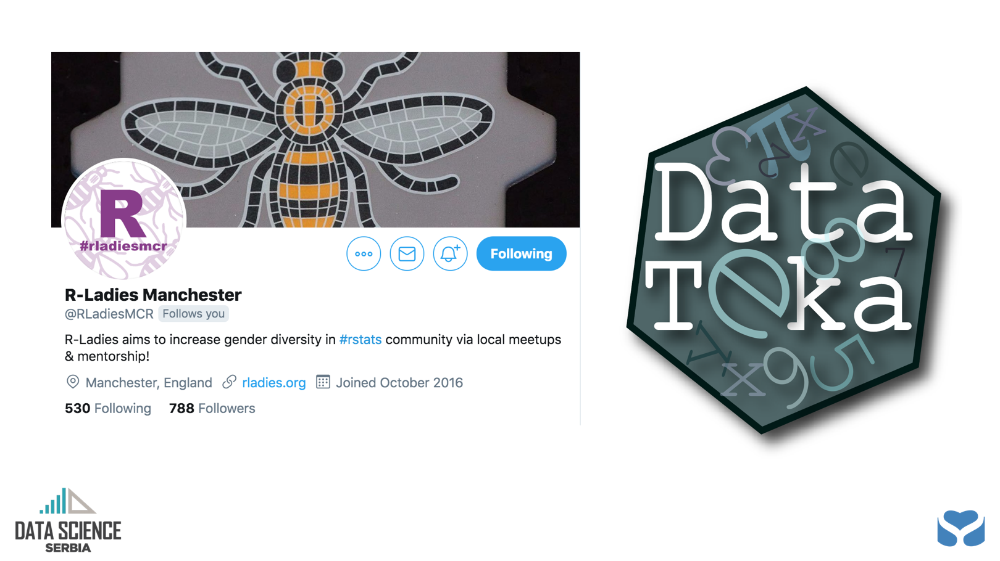
```

---
class: center, middle

```{r, out.width = "900px", echo=FALSE}
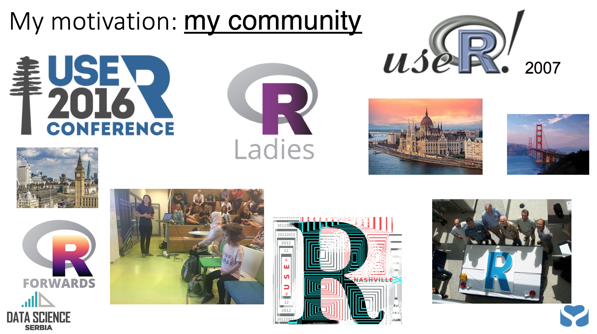
```

---
class: center, middle

```{r, out.width = "900px", echo=FALSE}
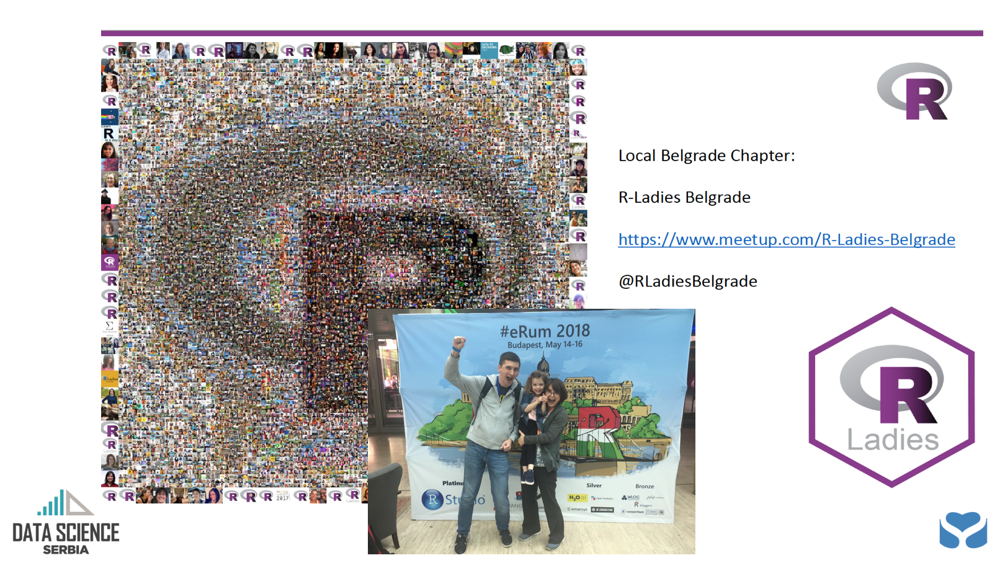
```

---
class: center, middle

```{r, out.width = "900px", echo=FALSE}

```

---
class: center, middle

```{r, out.width = "900px", echo=FALSE}
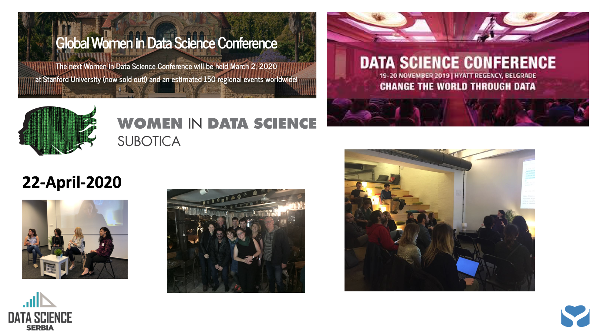
```

---
class: center, middle

```{r, out.width = "900px", echo=FALSE}
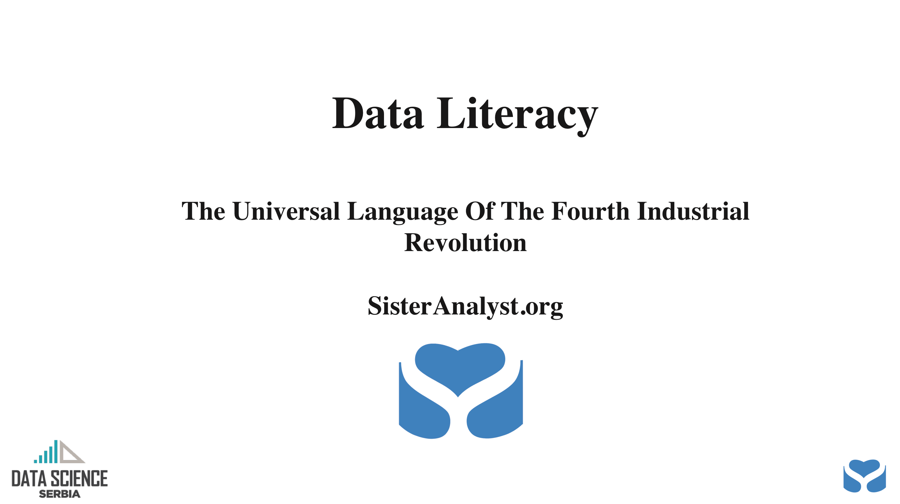
```

---
class: center, middle

```{r, out.width = "900px", echo=FALSE}

```

---
class: center, middle

```{r, out.width = "900px", echo=FALSE}
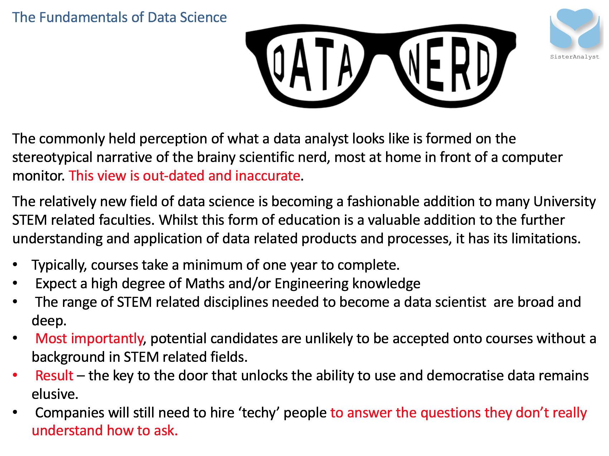
```

---
class: center, middle

```{r, out.width = "900px", echo=FALSE}
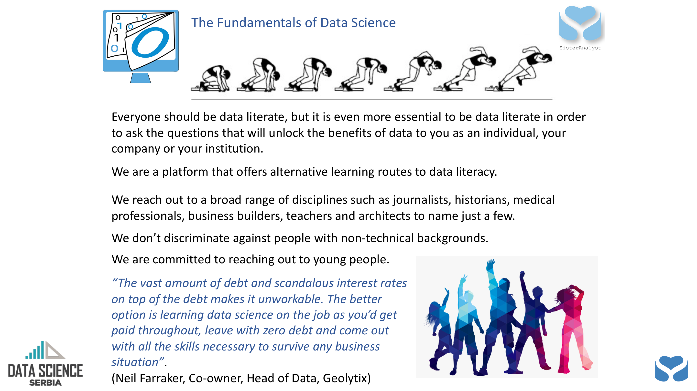
```

---
class: center, middle

```{r, out.width = "900px", echo=FALSE}
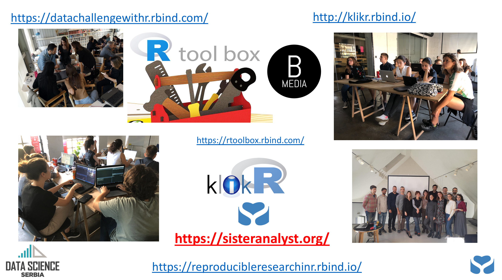
```

---
class: center, middle

```{r, out.width = "400px", echo=FALSE}
knitr::include_graphics("images/DataLiteracy.jpg")
```

### <https://dataliteracy.netlify.com/>
