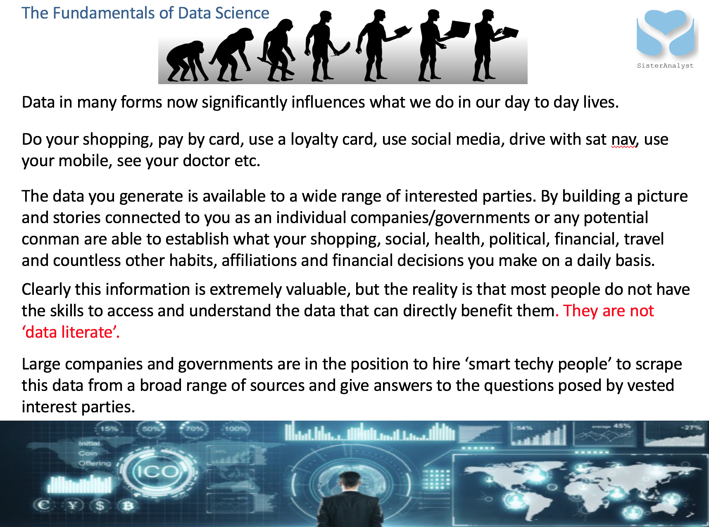
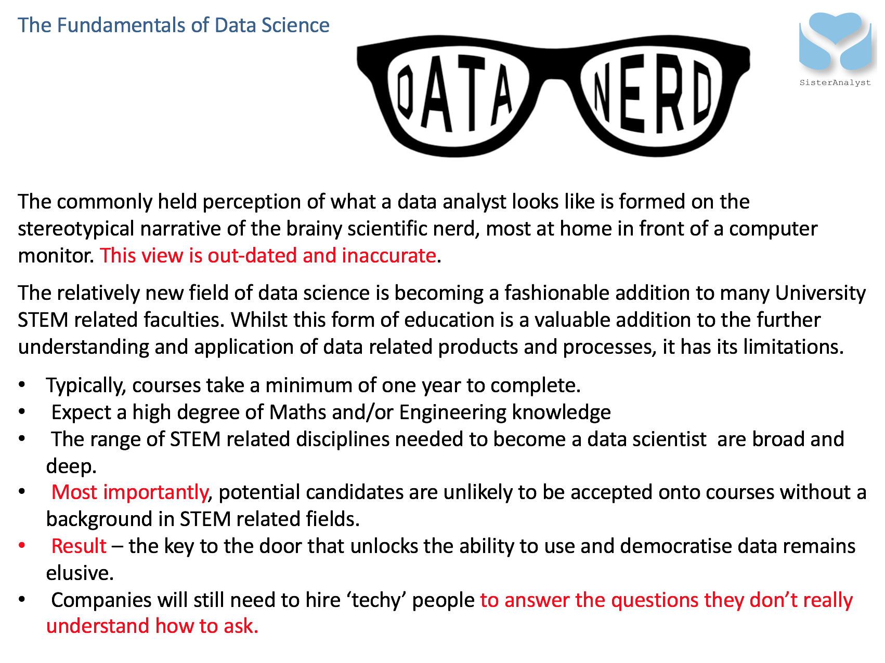
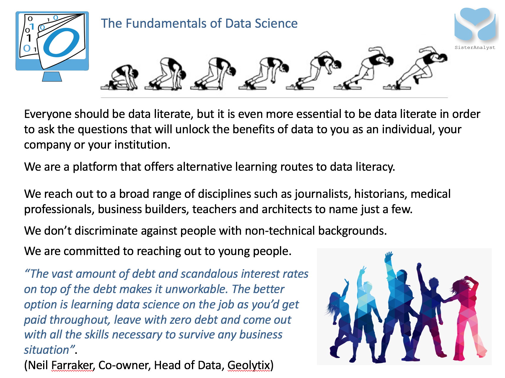
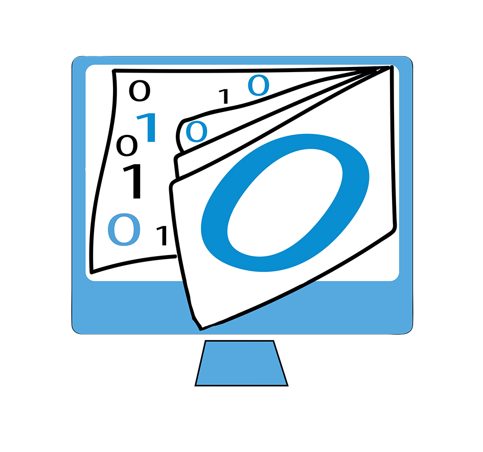

```{r setup, include=FALSE}
options(htmltools.dir.version = FALSE)
```
class:  center, middle

```{r, out.width = "1000px", echo=FALSE}

```

---
class: center, middle

```{r, out.width = "900px", echo=FALSE}

```

---
class: center, middle

```{r, out.width = "900px", echo=FALSE}

```

---

class: inverse, center, middle

```{r, out.width = "400px", echo=FALSE}

```

### <https://dataliteracy.netlify.com/>
